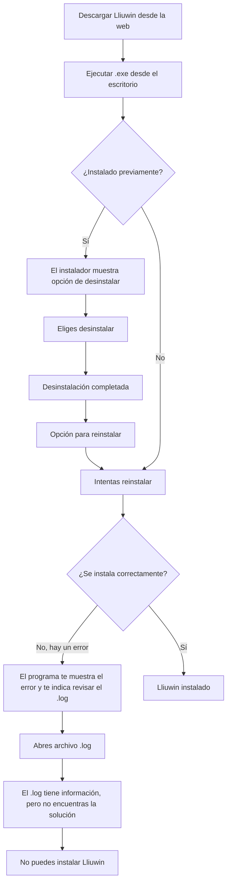

```mermaid
flowchart TD
    A["Descargar Lliuwin desde la web"] --> B["Ejecutar .exe desde el escritorio"]
    B --> C{"¿Instalado previamente?"}
    C -- "Sí" --> D["El instalador muestra opción de desinstalar"]
    D --> E["Eliges desinstalar"]
    E --> F["Desinstalación completada"]
    F --> G["Opción para reinstalar"]
    G --> H["Intentas reinstalar"]
    H --> I{"¿Se instala correctamente?"}
    I -- "No, hay un error" --> J["El programa te muestra el error y te indica revisar el .log"]
    J --> K["Abres archivo .log"]
    K --> L["El .log tiene información, pero no encuentras la solución"]
    L --> M["No puedes instalar Lliuwin"]
    I -- "Sí" --> N["Lliuwin instalado"]
    C -- "No" --> H
```
