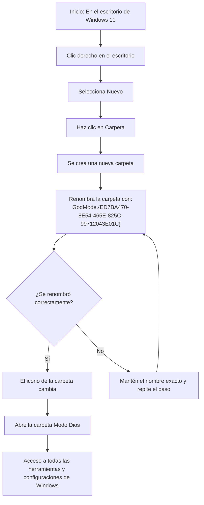

```mermaid
flowchart TD
    I["Inicio: En el escritorio de Windows 10"] --> A["Clic derecho en el escritorio"]
    A --> B["Selecciona Nuevo"]
    B --> C["Haz clic en Carpeta"]
    C --> D["Se crea una nueva carpeta"]
    D --> E["Renombra la carpeta con:<br>GodMode.{ED7BA470-8E54-465E-825C-99712043E01C}"]
    E --> F{"¿Se renombró correctamente?"}
    F -->|"Sí"| G["El icono de la carpeta cambia"]
    G --> H["Abre la carpeta Modo Dios"]
    H --> K["Acceso a todas las herramientas y configuraciones de Windows"]
    F -->|"No"| J["Mantén el nombre exacto y repite el paso"]
    J --> E
```
