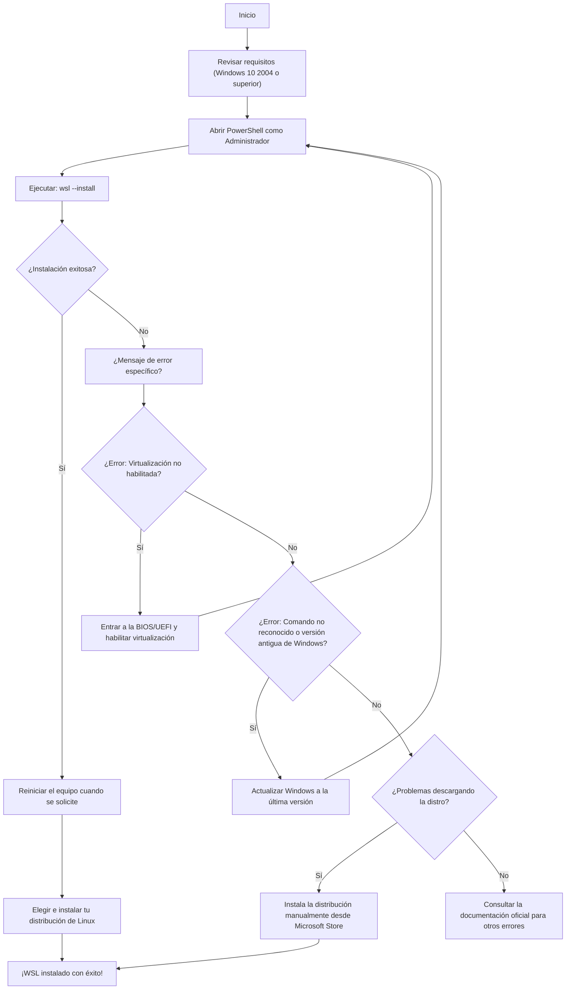

```mermaid
flowchart TD
    A["Inicio"] --> B["Revisar requisitos (Windows 10 2004 o superior)"]
    B --> C["Abrir PowerShell como Administrador"]
    C --> D["Ejecutar: wsl --install"]
    D --> E{"¿Instalación exitosa?"}
    E -- Sí --> F["Reiniciar el equipo cuando se solicite"]
    F --> G["Elegir e instalar tu distribución de Linux"]
    G --> H["¡WSL instalado con éxito!"]
    E -- No --> I["¿Mensaje de error específico?"]
    I --> J{"¿Error: Virtualización no habilitada?"}
    J -- Sí --> K["Entrar a la BIOS/UEFI y habilitar virtualización"]
    K --> C
    J -- No --> L{"¿Error: Comando no reconocido o versión antigua de Windows?"}
    L -- Sí --> M["Actualizar Windows a la última versión"]
    M --> C
    L -- No --> N{"¿Problemas descargando la distro?"}
    N -- Sí --> O["Instala la distribución manualmente desde Microsoft Store"]
    O --> H
    N -- No --> P["Consultar la documentación oficial para otros errores"]
```
