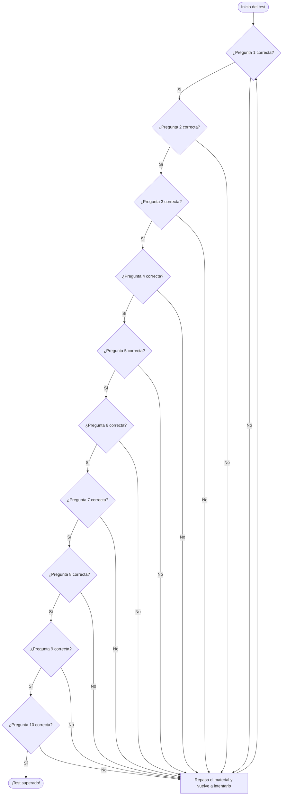

```mermaid
flowchart TD
    Start(["Inicio del test"])
    Q1{"¿Pregunta 1 correcta?"}
    Q2{"¿Pregunta 2 correcta?"}
    Q3{"¿Pregunta 3 correcta?"}
    Q4{"¿Pregunta 4 correcta?"}
    Q5{"¿Pregunta 5 correcta?"}
    Q6{"¿Pregunta 6 correcta?"}
    Q7{"¿Pregunta 7 correcta?"}
    Q8{"¿Pregunta 8 correcta?"}
    Q9{"¿Pregunta 9 correcta?"}
    Q10{"¿Pregunta 10 correcta?"}
    Repasa["Repasa el material y vuelve a intentarlo"]
    End(["¡Test superado!"])

    Start --> Q1
    Q1 -- Sí --> Q2
    Q1 -- No --> Repasa
    Repasa --> Q1

    Q2 -- Sí --> Q3
    Q2 -- No --> Repasa
    Q3 -- Sí --> Q4
    Q3 -- No --> Repasa
    Q4 -- Sí --> Q5
    Q4 -- No --> Repasa
    Q5 -- Sí --> Q6
    Q5 -- No --> Repasa
    Q6 -- Sí --> Q7
    Q6 -- No --> Repasa
    Q7 -- Sí --> Q8
    Q7 -- No --> Repasa
    Q8 -- Sí --> Q9
    Q8 -- No --> Repasa
    Q9 -- Sí --> Q10
    Q9 -- No --> Repasa
    Q10 -- Sí --> End
    Q10 -- No --> Repasa
```
