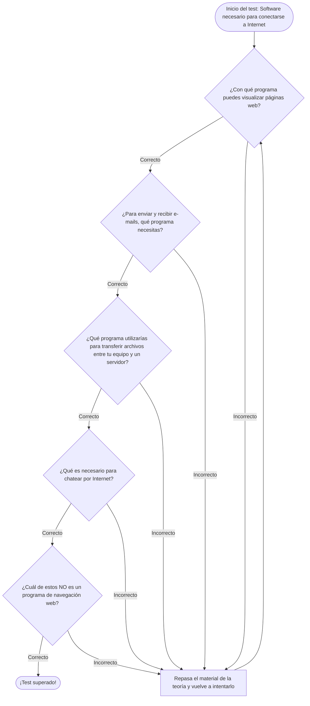

```mermaid
flowchart TD
    Start(["Inicio del test: Software necesario para conectarse a Internet"])
    Q1{"¿Con qué programa puedes visualizar páginas web?"}
    Q2{"¿Para enviar y recibir e-mails, qué programa necesitas?"}
    Q3{"¿Qué programa utilizarías para transferir archivos entre tu equipo y un servidor?"}
    Q4{"¿Qué es necesario para chatear por Internet?"}
    Q5{"¿Cuál de estos NO es un programa de navegación web?"}
    Repasa["Repasa el material de la teoría y vuelve a intentarlo"]
    End(["¡Test superado!"])

    Start --> Q1
    Q1 -- "Correcto" --> Q2
    Q1 -- "Incorrecto" --> Repasa
    Repasa --> Q1

    Q2 -- "Correcto" --> Q3
    Q2 -- "Incorrecto" --> Repasa

    Q3 -- "Correcto" --> Q4
    Q3 -- "Incorrecto" --> Repasa

    Q4 -- "Correcto" --> Q5
    Q4 -- "Incorrecto" --> Repasa

    Q5 -- "Correcto" --> End
    Q5 -- "Incorrecto" --> Repasa
```
